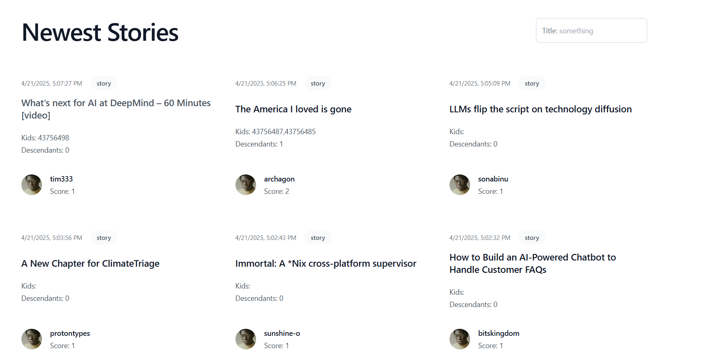

# Assessment
A simple application that consumes HackerNews API.

## Preview

## Backend

This application doesn't require any database connection and uses *in-memory* data invalidated *every 5 minutes*.

### Specifications

- Clean Architecture
- .net Core 8

### Run

Please navigate to the *backend/Presentation* and run `dotnet build` and then `dotnet run`.

### Test

Please navigate to the *backend/Tests/Integration* and run `dotnet test` to run the existing test cases.

## Frontend

A simple Angular 18 application that connects to the above server-side application.

### Run

Please navigate to the *frontend* folder and run `npm i` and then `npm start`

### Test

Please navigate to the *frontend* folder and run `npm test` to run all the existing test cases.